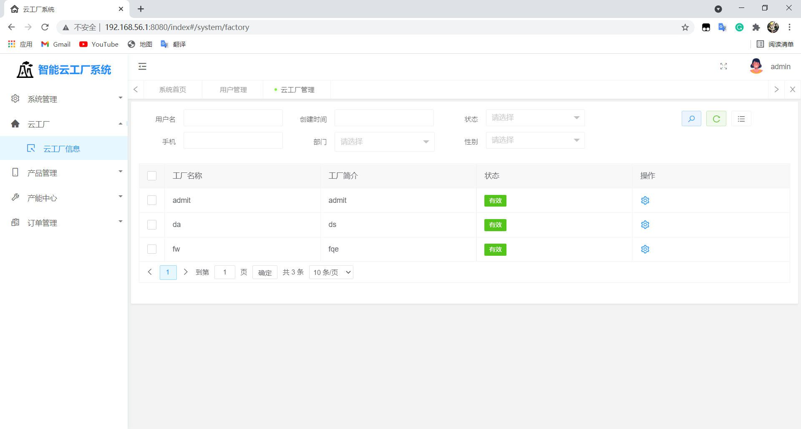

## About the Project
This project has been improved on the previous CloudFactory, moving all the functions to the web page, focusing on the optimization of the front end and back end, improving the corresponding efficiency, and also using MybatisPlus to facilitate retrieving data from the database and returning to the front end
## Write with
- java
- Jsp
- Servlet
- html
- css
- Ajax
- JDBC
- Maven
- Springboot
- LayUI
- MybatisPlus
## Improvement:The optimization of the showing page for all the functions 
### Register and login
System users are divided into three roles, system administrator, factory owner, worker, user can register as a cloud factory administrator, or dealer according to their own needs. The system administrator is the system default and cannot register. If the user is registered as a factory owner, you want to create a cloud factory for the user and assign the cloud factory administrator permissions; if the user is registered as a worker, assign the user the user to the worker permission. After successful registration, the user logs in according to the registered account password and displays different interfaces according to different permissions. 

  

  

### Cloud factory management
Used to maintain the status of the factory. 

  

### Product management
Used for the administrator to maintain all the information of the product category, and for the administrator to maintain all the information of the product information, add, delete, modify and check. 

  

### Equipment management
Used for the super administrator to maintain all the information of the product equipment type, and for the super administrator to maintain all the information of the equipment information, add, delete, modify and check. 

  

### Order management
Workers, factory owner order management, the system administrator can create and publish the order through their own needs, and after the system administrator bids, the bid is selected, and finally the receipt ends the entire order. Workers, factory owners can view orders after they are issued, and bid on them, while scheduling, producing and shipping them after winning the bid. 

  

